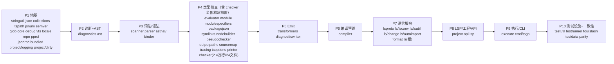

# typescript-go → Rust 重写 · 分阶段实现指引

本目录记录把 **`github.com/microsoft/typescript-go`**（Go 实现的 TypeScript 编译器 + 语言服务，
~30.4 万行实现 / 489 个非测试文件 / 4383 个测试文件）用 **TDD 逐文件 1:1 移植到 Rust** 的全套实施文档。

> 方法论与共享契约见 **[PORTING.md](./PORTING.md)（必读）**。本 README 只讲 phase 划分、依赖序、进度与纪律。

## 核心方法（一句话）

测试先行的逐文件 1:1 移植：`.rs` 紧贴 `.go` 同目录同名、源 Go 不删、每个 `internal/<pkg>` 一个 `tsgo_<pkg>` crate、
**每个文件先移植 `*_test.go`（red）→ 再移植实现（green）**、模块编译通过 + 测试全绿才进入下一个、
AST 用 arena + `NodeId` 索引（零 unsafe）、并发用 rayon/std::thread（要性能、保确定性）。

## 依赖序与 Phase 划分

按 `internal/` 各包真实 import 边（DAG）排出 10 个 phase，叶子先行：



每个 phase 目录下，**每个包一个子目录**，含 `impl.md`（移植步骤 + 文件清单 + 类型/所有权映射 + 可勾选 TODO）
与 `tests.md`（逐 `func Test*` / 逐表驱动子用例对齐 Go 真实测试）。

> **依赖序口径（gate-docs.sh D6 据此判定，子包粒度）**：
> - **构建边**（出现在非 `*_test.go`）：必须被 phase 序尊重——任何包不得依赖排在更后 phase 的包（同 phase 内可互依）。
> - **仅测试边**（只在 `*_test.go`）：→ Rust **dev-dependency**，不约束 phase 序。典型：`checker→compiler`、`ls→project`、`printer→transformers`、`tsoptions→diagnosticwriter`（均仅测试）。
> - **测试设施包**（`testutil`/`testrunner`/`fourslash` 及 `*tests`/`*testutil`/`*mock` 子包，如 `execute/tsctests`）：归 P10，其入边按 dev-dep，不约束生产 phase 序。
> - **拆分子 crate**（破环 / 解倒置 / 1:1 映射 Go package）：`lsp/lsproto`→`tsgo_lsproto`；`ls/lsconv`→`tsgo_ls_lsconv`、`ls/lsutil`→`tsgo_ls_lsutil`、`ls/change`→`tsgo_ls_change`、`ls/autoimport`→`tsgo_ls_autoimport`（均 P7，早于 `ls` 根）；`project/dirty`→`tsgo_project_dirty`、`project/logging`→`tsgo_project_logging`（P1 叶子）。其余子包默认归并父 crate。**为何拆 `ls/*`**：`format` 必须依赖 `ls/lsutil`，若 lsutil 是 `ls` 的子 module 会成 `format→ls→format` 环；且 `project` 依赖 `ls/autoimport` 而 autoimport 依赖 `project/dirty,logging`，把这三者从父 crate 拆出才能打破 `ls↔project` 环（Cargo 禁止 crate 环）。详见 [references/crate-map.md](./references/crate-map.md) 与 [references/gates.md](./references/gates.md)。
> - 相比初版：`printer`/`sourcemap`/`outputpaths`/`tsoptions`/`tracing` 前移到 P4（checker 的构建前置）；`transformers` 留在 checker 之后（P5）；`jsonrpc`/`bundled` 前移到 P1；`lsproto`/`ls/lsconv`/`ls/lsutil` 进 P7（早于 `ls` 主体）；`project`/`api`/`lsp` 留 P8。

## Phase 进度

> 勾选规则：`impl.md` 全部实现类 TODO 为 `[x]` 且 `tests.md` 应收口测试行均 `✓`，方可标 `[x]`。
> 本轮先产出**文档**（impl.md + tests.md），代码实现随后按文档执行 TDD。

- [x] **P1 地基** — `stringutil` `json` `collections` `tspath` `jsnum` `semver` `glob` `core` `debug` `vfs` `locale` `repo` `pprof` `jsonrpc` `bundled`（15 crate 全绿，663 测试 pass，gate C1–C8 GREEN）
- [x] **P2 诊断+AST** — `diagnostics` `ast`（17 crate workspace 全绿；diagnostics 30 单测+7 doctest；ast 用 arena+NodeId/enum NodeData/bitflags，52 单测+22 doctest，positionmap 绿，deepclone 全表 DEFER(phase-3) 待 parser）
- [x] **P3 词法/语法** — `scanner` `parser`(4 轮深化,语法完整;JSDoc reparser backlog) `astnav` `binder`(按 §2 拆 4 文件)。parser 104 单测 / ast 扩至全量 NodeData
- [ ] **P4 类型检查** — 构建前置全部 ✅：`evaluator` `module`(12文件) `modulespecifiers` `packagejson` `symlinks` `nodebuilder` `pseudochecker` `outputpaths` `sourcemap` `tracing` `tsoptions`(14文件) `printer`(emit核心,§2拆10文件) ｜ 🔄 仅剩 `checker`(波5)。backlog: printer 第3轮(comment/sourcemap/node-names) + tsoptions tsconfigparsing + parser JSDoc/import()bug
- [ ] **P5 Emit** — `transformers` `diagnosticwriter`
- [ ] **P6 编译管线** — `compiler`
- [ ] **P7 语言服务** — `lsproto` `project/dirty` `project/logging` `ls/lsconv` `ls/lsutil` `ls/change` `ls/autoimport` `format` `ls`
- [ ] **P8 LSP/工程/API** — `project` `api` `lsp`
- [ ] **P9 执行/CLI** — `execute` `cmd/tsgo`
- [ ] **P10 测试设施 + 一致性 parity** — `testutil` `testrunner` `fourslash` + `testdata` 端到端对拍

## 包 → 测试规模速查（采自当前仓库）

| 包 | 实现文件 | 测试文件 | 测试函数 | 备注 |
|---|---|---|---|---|
| stringutil | 2 | 1 | 1 | 表驱动，含多子用例 |
| collections | 7 | 3 | 8 | OrderedMap/Set/syncmap/cow |
| core | 28 | 1 | 1 | 地基核心，表驱动 |
| tspath | 3 | 4 | 32 | 路径工具 |
| jsnum | 3 | 4 | 19 | JS number 语义 |
| semver | 2 | 2 | 11 | |
| vfs | 20 | 13 | 68 | 含 iovfs/vfstest 等子包 |
| ast | 21 | 2 | 12 | arena+NodeId 落地点 |
| scanner | 4 | 0 | 0 | 无直接单测→P10 兜底 |
| parser | 6 | 1 | 3 | 子目录 3 |
| binder | 3 | 1 | 1 | |
| checker | 24 | 2 | 3 | 最硬，靠 conformance |
| printer | 15 | 3 | 105 | emit 测试大户 |
| transformers | 40 | 2 | 2 | 子目录 6 |
| tsoptions | 18 | 8 | 19 | |
| compiler | 14 | 2 | 5 | |
| ls | 60 | 8 | 21 | 语言服务实现 |
| lsp | 9 | 13 | 42 | |
| project | 38 | 26 | 39 | |
| api | 19 | 4 | 27 | |
| execute | 30 | 8 | 50 | CLI 行为 |
| fourslash | 7 | 4250 | 4386 | **P10 端到端 parity** |
| testutil | 27 | 1 | 2 | 14 子目录，baseline 框架 |

> **0 直接单测**的包：`diagnosticwriter` `evaluator` `glob` `json` `jsonrpc` `locale` `nodebuilder` `outputpaths` `pprof` `pseudochecker` `repo` `scanner`。
> 这些在各自 `tests.md` 标注"行为由 P10 parity 兜底"，并补少量行为级 Rust 测试。

## 实施纪律（每个包收口前）

1. 读 `impl.md` + `tests.md` + **对应 Go 源码 + `*_test.go`**。
2. 先写 Rust 测试（red）→ 再写实现（green），逐文件、逐用例。
3. 验证：`cargo test -p tsgo_<pkg>` 全绿 + `cargo clippy -p tsgo_<pkg>` 干净 + rustdoc 规范自检（见 PORTING §7）。
4. tests.md 与 Go 测试逐用例对齐审查（见 PORTING §8），impl.md 与 tests.md 互对齐。
5. **跑 `bash docs/rust-rewrite/scripts/gate.sh --strict` 全绿**（文档+代码门禁，见 [gates.md](./references/gates.md)）。
6. 勾选文档，更新本 README 进度（gate 未全绿不得打 `[x]`）。

## 子代理（subagent）执行约定

> 本项目用 subagent 并行/串行推进移植。所有起 subagent 的场景遵守以下约定。

1. **一律用英文给 subagent 写 prompt / 交流**（与代码、注释、测试同语言，保持上下文一致、避免歧义）。
2. **每个 subagent 必须遵循 `/tdd` 与本 README**（红→绿逐行为、严禁横切；收口判据同「实施纪律」）。
3. **并行安全 = 编辑边界不重叠 + 之间无构建依赖边**：两个 lane 只有在「各自只改互不重叠的 crate」且「彼此不在对方构建依赖链上」时才可并行；否则一个 lane 的 TDD 红 / 半改非编译态会拖垮另一个的 `-p` 构建。`checker → transformers → compiler` 这条链上的包两两有构建依赖，只能单 lane 串行推进。
4. **并行期间各 lane 用 `cargo <cmd> -p <crate>` 限定 gate**（不要 `--workspace`），避免互相编译对方 in-flight 的 crate。
   - **🔴 改动 `checker`/类型解析的轮次，gate 必须加跑 `cargo test -p tsgo_compiler`**：`tsgo_checker` 的单测多用 `StubProgram`（单文件、无真实 lib），无法覆盖**真实多文件 lib 加载路径**（跨文件 arena 解析、循环类型、`view_for_symbol`）。C-B1 曾因只跑 `-p tsgo_checker` 漏掉两个回归（跨 arena 越界 panic + 循环 type-alias 栈溢出），到 P6-7 才被发现。凡触及 declared-types / 类型实例化 / EmitResolver / 符号解析，收口前务必 `cargo test -p tsgo_compiler` 绿。
5. **🔴 单测只能比 Go 多、不能少；行覆盖率目标 ≥ 90%**：在 1:1 移植 Go `*_test.go` 全部用例之上，**为每个重要函数额外补行为级单测**（公开 `pub fn` 必测，不平凡的私有函数也测，即使 Go 没测），用 `/tdd` 红→绿逐条写出（绝不横切、不写无断言的凑数测试）。每轮报告给出 `cargo test` 计数增量。详见 [PORTING.md §8 第 10 条](./PORTING.md)。
6. **🔵 subagent 一律后台跑、不阻塞主流程**：起 subagent 用 `run_in_background: true`，**不要**阻塞式同步等待、**不要**轮询。深链（`checker → transformers → compiler`）只能单 lane，故标准节奏是「**后台起一个 → 结束本轮 → 收到完成回调 → 父级验证 gate + 提交 → 再后台起下一个**」。这样用户随时可插话/纠偏，父级也能在等待期间做提交、写下一轮 briefing、跑集成构建等非冲突工作。仅当某轮结果是后续步骤的硬前置且无其它可做时，才用 `AwaitShell`/回调阻塞。
7. **🔵 todo 粗粒度、每个 subagent 吃一个内聚子系统块**：避免「一个微行为一轮」的高 handoff 开销。把工作按**内聚子系统**切成少量大 todo（如「函数类型关系+变型」「泛型基石」「高级类型 keyof/条件/映射」整块），每次 subagent 一次推进**一组相关行为 / 一批函数**（典型 ~15–40 函数 / ~40–80 新单测），而非单个切片。**TDD 红→绿仍在 subagent 内部逐切片执行**（§2、第 5 条不变）——「大 todo」只表示一次多做几个垂直切片，绝不等于横切或一次写完所有测试。大子系统（泛型、语言服务、一致性 parity）允许一个 todo 跨多次 subagent，但每次仍交付 gate 全绿的内聚增量。

## 质量 Gate（文档 gate + 代码 gate）

把上面的实施纪律**硬化为可运行门禁**。脚本在 `scripts/`，说明见 **[references/gates.md](./references/gates.md)**。

```bash
bash docs/rust-rewrite/scripts/gate-docs.sh   # 文档 gate（纯 bash+rg，现在就能跑）
bash docs/rust-rewrite/scripts/gate-code.sh   # 代码 gate（无 Cargo.toml 时优雅跳过）
bash docs/rust-rewrite/scripts/gate.sh        # 聚合：--docs-only | --code-only | --strict
```

- **文档 gate**：结构完整 / `// Go:` 锚 / checkbox 纪律 / 完成列图例 / 命名红线 / **依赖序倒置检测**。
- **代码 gate**：`fmt` + `clippy -D warnings` + `test`(含 doctest) + unsafe-须-SAFETY + rustdoc `missing_docs` + test-go-parity + stub-readiness。
- **收口纪律**：**phase 收口前必须 `gate.sh` 全绿，才能在上面的进度表打 `[x]`**（详见 gates.md §C）。
- ✅ 初版抓到的 **12 处跨 phase 依赖序倒置已全部解决**（`tsoptions`/`printer`/`sourcemap`/`outputpaths`/`tracing` 前移 P4；`jsonrpc`/`bundled` 前移 P1；`lsproto`/`ls/*` 拆 crate 入 P7；`project/{dirty,logging}` 拆入 P1），D6 现为 GREEN。详见 [gates.md §E](./references/gates.md)。

## 文档导航

| 想做什么 | 看哪里 |
|---|---|
| 严格 TDD 纪律（`/tdd` 原文 + 移植场景红→绿规则） | [references/tdd.md](./references/tdd.md) |
| 方法论 / 类型映射 / AST 模型 / 并发 / 注释 / 测试对齐规范 | [PORTING.md](./PORTING.md) |
| 质量 gate（文档+代码门禁）/ 收口纪律 / CI 示例 | [references/gates.md](./references/gates.md) · `scripts/` |
| impl.md / tests.md 写法模板 | [references/TEMPLATE-impl.md](./references/TEMPLATE-impl.md) · [references/TEMPLATE-tests.md](./references/TEMPLATE-tests.md) |
| Go 依赖 → Rust crate 映射 | [references/crate-map.md](./references/crate-map.md) |
| 某个 phase 的实施细节 | `phase-N-*/<pkg>/impl.md` + `tests.md` |
| Go 上游源码 | `internal/<pkg>/`（ground truth；行号会漂移，用 `<file>:<func>` 锚） |

## 参考：Bun 的 Zig→Rust 移植

我们借鉴 Bun 的"结构优先、逐文件 1:1、保结构/函数名/字段序、`PERF(port)` 标记"方法论，
但**不**采用其 Phase-A"不需要编译"与"禁 rayon/tokio"约束 —— 我们要测试 gate + 真并发。
- Bun `PORTING.md`：https://github.com/oven-sh/bun/blob/claude/phase-a-port/docs/PORTING.md
- Bun rewrite plan：https://github.com/oven-sh/bun/blob/eeb4d9fdf6e9a7bdd45388d7f3a03dcf570839ad/docs/rust-rewrite-plan.md
