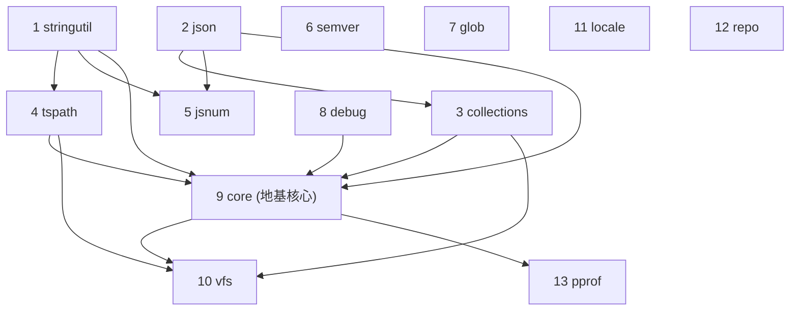

# Phase 1 · 地基（Foundation）

本 phase 移植 typescript-go 最底层、零/少内部依赖的 13 个包。它们是 P2（diagnostics/ast）及之后所有 phase 的前置：没有它们，scanner/parser/checker 无法落地。

> 方法论与共享契约见 [../PORTING.md](../PORTING.md)（必读）。模板见 [../references/TEMPLATE-impl.md](../references/TEMPLATE-impl.md) / [../references/TEMPLATE-tests.md](../references/TEMPLATE-tests.md)。

## 包清单（叶子先行的移植次序）

下表即**推荐落地顺序**：严格按内部依赖序，被依赖者先行。`core` 是地基核心，必须排在它依赖的 5 个包（collections/stringutil/tspath/debug/json）之后。

| # | 包 | crate | 一句话职责 | 内部依赖 | 实现文件 | 直接单测 |
|---|---|---|---|---|---|---|
| 1 | stringutil | `tsgo_stringutil` | 字符/字符串原语（空白、URI 编码、比较器） | 无 | 2 | 1 func / 3 子用例 |
| 2 | json | `tsgo_json` | JSON 序列化薄封装（→ serde） | 无 | 1 | 0（P10 兜底） |
| 3 | collections | `tsgo_collections` | 有序/并发/写时复制 map/set | json | 7 | 8 func |
| 4 | tspath | `tsgo_tspath` | 路径模型与全部路径工具 | stringutil | 3 | 24 func / 280+ 断言 |
| 5 | jsnum | `tsgo_jsnum` | JS number/bigint 语义 | stringutil, json | 3 | 15 func / 400+ 子用例 |
| 6 | semver | `tsgo_semver` | semver 版本 + npm range | 无 | 2 | 11 func / 470+ 子用例 |
| 7 | glob | `tsgo_glob` | LSP glob 匹配 | 无 | 1 | 0（P10 兜底） |
| 8 | debug | `tsgo_debug` | 断言/失败原语（panic） | 无 | 1 | 11 func |
| 9 | **core** | `tsgo_core` | **地基核心**：工具/文本/选项/枚举/并发/arena | collections, stringutil, tspath, debug, json | 28 | 1 func / 5 子用例 |
| 10 | vfs | `tsgo_vfs` | 文件系统抽象 + 实现 + glob 匹配 + 监视 | tspath, core, collections | 20（9 子包） | 13 文件 / ~58 func |
| 11 | locale | `tsgo_locale` | 界面语言标签 | 无 | 1 | 0（P10 兜底） |
| 12 | repo | `tsgo_repo` | 测试期仓库路径定位 | 无 | 1 | 0（P10 兜底） |
| 13 | pprof | `tsgo_pprof` | 性能剖析启停/落盘 | core（VersionMajorMinor） | 1 | 0（P10 兜底） |

> 注：`locale`/`repo`/`pprof` 无内部 import 边（pprof 仅用 core 的 `VersionMajorMinor`），可与前面任意叶子并行落地；放在末尾是因为它们与编译器主流程关系最弱（locale 走 diagnostics、repo/pprof 是设施）。

## 包间依赖图



**拓扑要点**：
- 第一波（纯叶子，可并行）：`stringutil` `json` `semver` `glob` `debug` `locale` `repo`。
- 第二波：`collections`（依赖 json）、`tspath`（依赖 stringutil）。
- 第三波：`jsnum`（依赖 stringutil + json）。
- 第四波：**`core`**（依赖 collections/stringutil/tspath/debug/json）。
- 第五波：`vfs`（依赖 tspath/core/collections）、`pprof`（依赖 core）。

## 本 phase 的关键映射决策（汇总，细节见各包 impl.md）

| 关注点 | 决策 |
|---|---|
| 有序 map/set | `OrderedMap`→`indexmap::IndexMap`、`OrderedSet`→`IndexSet`；**delete 用 `shift_remove` 保插入序** |
| 普通 set | `Set`→`FxHashSet`（newtype 包装挂方法 + 集合代数） |
| 并发 map/set | `SyncMap`/`SyncSet`→`dashmap`；`syncmap` 的 nil 值语义用 `Option` |
| 写时复制 | `CopyOnWriteMap/Set`→`Rc + Rc::make_mut`，`EnterScope`→RAII guard |
| arena | `core.Arena[T]`→`typed-arena`/`la-arena` 索引（与 AST NodeId 模型统一，零 unsafe） |
| 三态 | `Tristate`→`enum{Unknown,False,True}` + JSON(true/false/null) |
| 路径 | `tspath.Path`→自写 newtype（**非** `std::path::Path`，TS 用 `/`-字符串模型） |
| JS number | `jsnum.Number`→`f64` newtype；`Number.toString` 需 JS 兼容 dtoa（命门） |
| 文本位置 | `TextPos`→`i32` newtype、`TextRange{pos,end}` |
| 并发 | WorkGroup/ThrottleGroup/BFS → rayon/std::thread::scope + 原子；**输出保确定性** |
| context.Context | 不复刻隐式携带（locale/request id），改**显式传参**（PORTING §3） |
| 去 unsafe | `tspath.ToFileNameLowerCase`/`vfs.ReadFile`/`vfstest.WriteFile` 的 `unsafe.String` → 安全 `String`（`// PERF(port)`） |
| io/fs 抽象 | Rust 无 `io/fs`；vfs 的 `Fs` trait 直接定义，osvfs 基于 `std::fs`，内存 FS 自写 |

## 新增依赖白名单（汇总到 references/crate-map.md）

`indexmap` · `rustc_hash` · `dashmap` · `regex` · `thiserror` · `serde`/`serde_json` · `num-bigint` · `unic-langid` · `rayon` · `crossbeam-channel` · `typed-arena`/`la-arena` · `xxhash-rust` · `encoding_rs`（或 std `decode_utf16`）· `pprof`(pprof-rs) · `tempfile`/`rstest`/`proptest`（测试）。
> 执行期一律 `cargo add` 取最新稳定版，不要瞎编版本号。

## 测试纪律（每个包收口前）

照 PORTING §8/§9 与根 README 的"实施纪律"：
1. 读 `impl.md` + `tests.md` + 对应 Go 源 + `*_test.go`。
2. 先写 Rust 测试（red）→ 再写实现（green），逐文件、逐用例。
3. 验证：`cargo test -p tsgo_<pkg>` 全绿 + `cargo clippy -p tsgo_<pkg>` 干净 + rustdoc 规范自检（PORTING §7）。
4. tests.md 与 Go 测试逐用例对齐审查；impl.md 与 tests.md 互对齐。
5. 勾选文档，更新根 README 进度。

## 收口标准（Phase 1 完成 = 进入 Phase 2 的门槛）

- [ ] 13 个 crate 全部加入 workspace，`cargo build` 全绿。
- [ ] 每个包 `cargo test -p tsgo_<pkg>` 全绿；`tests.md` 中**有 Go 字面量 expected** 的用例行全部 `✓`（0 直接单测的包则补充的行为级测试全绿）。
- [ ] 单测 1:1 对齐审查通过：每个 Go `func Test*` / 每个表驱动子用例都有 Rust 对应（漏一个子用例 = 未收口）。本 phase 重点 gate：
  - `tspath`（`TestGetNormalizedAbsolutePath` ~100 断言、`TestGetRootLength` ~50 断言、URL/untitled 根）
  - `jsnum`（`TestToInt32` 47、`ryu`/`fromString` ~220、dtoa 命门）
  - `semver`（`TestComparatorsOfVersionRanges` ~340 矩阵）
  - `vfsmatch`（`TestReadDirectory` + baselines ~95 glob case）
  - `core`（`TestBreadthFirstSearchParallel` 并行 BFS 确定性）
- [ ] `cargo clippy` 干净；所有 `pub` 项有合规 rustdoc（PORTING §7）。
- [ ] 已知偏离都在对应 impl.md "与 Go 的已知偏离"小节登记（arena 索引化、context→显式、去 unsafe、io/fs 缺失、dtoa 等）。
- [ ] 推迟项（Node 对拍、Fuzz、平台特化、Windows reparse）已在 tests.md "推迟"表登记并指向目标 phase。

## 与 Go 存疑/需实现期定夺的偏离（跨包汇总）

| 项 | 包 | 说明 |
|---|---|---|
| JS 兼容 dtoa | jsnum | `Number.toString` 需逐字节匹配 ECMAScript 算法；`ryu` crate 指数格式不同，须加格式层或移植算法 |
| 非法 UTF-8 容忍 | json | Go 默认 `AllowInvalidUTF8`；Rust `String` 必有效 UTF-8，倾向上游清洗 |
| arena 选型 | core/vfs | `typed-arena`（稳定 `&T`）vs `la-arena`（索引）——全仓统一，建议索引化对齐 AST NodeId |
| `io/fs` 缺失 | vfs | iovfs+internal+vfstest 的内存路径合并为自写内存 FS |
| 迭代中可变 | collections | `OrderedMap` 迭代时追加语义，IndexMap 不支持；上层若依赖需改写 |
| 平台 realpath/reparse | vfs/osvfs | darwin/linux/windows `#[cfg]` 特化，Windows junction 归平台 CI |
| pprof / 无 GC | pprof | Rust 无标准库 pprof、无 GC；CPU 用 pprof-rs，堆/分配用替代方案，语义不完全等价 |
| Node 对拍测试 | jsnum/vfs | 需真实 Node.js 的子测试/Fuzz 归 P10 parity / 可选集成 |
| `prerelease/build_part` 正则 | semver | 声明但未引用，待确认是否保留 |

## 产出文件索引

```
phase-1-foundation/
├── README.md            ← 本文件
├── stringutil/{impl,tests}.md
├── json/{impl,tests}.md
├── collections/{impl,tests}.md
├── tspath/{impl,tests}.md
├── jsnum/{impl,tests}.md
├── semver/{impl,tests}.md
├── glob/{impl,tests}.md
├── debug/{impl,tests}.md
├── core/{impl,tests}.md
├── vfs/{impl,tests}.md
├── locale/{impl,tests}.md
├── repo/{impl,tests}.md
└── pprof/{impl,tests}.md
```
