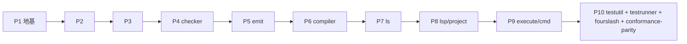

# Phase 10 — 测试设施 + 一致性 parity（收口 phase）

> 方法论与共享契约见 **[../PORTING.md](../PORTING.md)（必读，尤其 §6 测试范围 + §8 测试对齐）**。
> 本 README 讲清 P10 在整个移植里的定位、四个子目录的边界、以及"为什么 P10 是 fourslash 4250 测试 + conformance 的归宿"。

## 一句话定位

**P10 是把整条 Rust 编译管线（P1→P9 的产物）与 Go 生成的 `testdata/baselines` 逐字节对拍的收口 phase。**
它不实现新的编译器逻辑，而是**重建 Go 的 baseline harness + conformance 驱动器 + fourslash runner**，
让 Rust 侧用**同一批 `testdata/tests/cases` fixture**跑出与 Go 完全一致的 baseline，从而证明前 9 个 phase 的移植是正确的。

PORTING §6 已经敲定：早期各包按 `*_test.go` 做单测 gate，但 `fourslash`(4250) + `testdata`(294MB) 的**端到端 parity 推迟到 P10**。
P10 就是这个推迟项的兑现：它是所有"0 直接单测"包（`scanner` / `checker` / `printer` / `binder` / …）行为正确性的**最终兜底**。

## 为什么 P10 是 fourslash 4250 测试 + conformance 的归宿

| 这些东西 | 在前序 phase 的状态 | 在 P10 收口 |
|---|---|---|
| `internal/checker`（2.4 万行 / 仅 3 个直接单测） | P4 移植实现，单测覆盖率极低 | 由 conformance `*.errors.txt` / `*.types` / `*.symbols` baseline 对拍兜底 |
| `internal/printer` / `transformers` / `sourcemap` | P5 移植 | 由 conformance `*.js` / `*.d.ts` / `*.js.map` / sourcemap record baseline 对拍兜底 |
| `internal/ls`（语言服务 60 文件） | P7 移植 | 由 **fourslash 4250 测试**的 `*.baseline.jsonc` 等对拍兜底 |
| `internal/scanner` / `evaluator` / `nodebuilder` 等 0 单测包 | P1-P4 移植 | 通过上面两条间接全覆盖 |

换句话说：**前序 phase 移植代码，P10 证明它们对**。fourslash 的 4386 个测试函数和 ~227 个 conformance/compiler case 跑出的几万个 baseline 文件，是这条证明链的 ground truth。

## 依赖序（P10 在 DAG 末端）

P10 依赖**所有**前序 crate：`tsgo_testutil` 调 `tsgo_compiler` / `tsgo_checker` / `tsgo_printer` / `tsgo_tsoptions`；
`tsgo_fourslash` 调 `tsgo_lsp` / `tsgo_ls` / `tsgo_project`。所以它必须最后做。

## 子目录划分（每个含 impl.md + tests.md）

| 子目录 | crate | Go 源 | 职责 | 收口口径 |
|---|---|---|---|---|
| [`testutil/`](./testutil/) | `tsgo_testutil` | `internal/testutil/`（27 文件 / 14 子目录 / 1 测试 / 2 func） | **baseline 对拍框架**：`baseline.Run` 写 local + diff reference、`harnessutil.CompileFiles` 真编译、`tsbaseline.*` 各类 baseline 生成器、各种 fixture/mock helper | `cargo test -p tsgo_testutil` 全绿（含补的行为级测试）；被 testrunner/fourslash 复用 |
| [`testrunner/`](./testrunner/) | `tsgo_testrunner` | `internal/testrunner/`（3 文件 / 3 测试 / 4 func） | **conformance 驱动器**：枚举 `testdata/tests/cases/{compiler,conformance}` → `makeUnitsFromTest` 切多文件 → 跑配置变体 → 调 `harnessutil` + `tsbaseline` 出 8 类 baseline | 4 个 Go func 逐 func 对齐；`TestLocal` 在 Rust 侧跑通并产 local baseline |
| [`fourslash/`](./fourslash/) | `tsgo_fourslash` | `internal/fourslash/`（6 核心 .go + `tests/util/util.go`；**4250 生成 `*_test.go` / 4386 func**） | **语言服务 parity 框架**：解析 `/*marker*/` `[\|range\|]` `{\| obj \|}` DSL → 驱动 Rust LSP server → `VerifyXxx` 内联断言 + `VerifyBaselineXxx` 写 baseline | **不逐个枚举 4250 测试**；设计 parity 框架 + 抽样 3-5 个代表测试 + 复用同一批 fixture 的生成器思路 |
| [`conformance-parity/`](./conformance-parity/) | （无新 crate，跨 crate 集成层） | `testdata/`（294MB / 4.9 万文件） | **端到端对拍策略**：同一批 fixture 跑 Rust 管线 → 与 `testdata/baselines/reference` 逐字节 diff；diagnostics / emit / .d.ts / sourcemap / types / symbols 各类 baseline 的对拍口径 + 分批引入计划 | 文档级策略 + 分批 checklist（按 conformance 子目录、按 baseline 类型逐步开绿） |

## Go 测试规模速查（采自当前仓库）

| 包 | 实现文件 | 测试文件 | 测试函数 | 备注 |
|---|---|---|---|---|
| testutil | 27（含 14 子目录） | 1（`baseline/baseline_test.go`） | 2 | baseline harness，几乎全是被调 helper |
| testrunner | 3 | 3 | 4（`TestLocal` / `TestSubmodule` / `TestMakeUnitsFromTest` / `TestMain`） | conformance 驱动器 |
| fourslash | 6 + `tests/util/util.go` | **4250** | **4386** | 277 直接 + 3768 `gen/` + 205 `manual/` |
| testdata | — | — | — | 294MB / 4.9 万文件；`baselines/reference` 292MB（12500 `.js` / 12395 `.types` / 12395 `.symbols` / 7333 `.txt` / 2557 `.diff` / …） |

> fourslash 4250 = `internal/fourslash/tests/`（277 文件 / 413 func）+ `tests/gen/`（3768 / 3768，convertFourslash 生成）+ `tests/manual/`（205 / 205，手工转换）。

## P10 的"零字面值翻译" 红线（与 Bun 方法论的关键差异）

- **绝不逐个翻译 4250 个 Go `*_test.go`。** 这些 Go 测试本身就是从 TS 上游 `_submodules/TypeScript/tests/cases/fourslash/*.ts` 用 `convertFourslash.mts` **生成**的。
  Rust 侧的正确做法是**复用同一批 TS fixture + baseline**，写一个等价的 Rust 生成器（或直接复用现有 `.go` 生成产物作中间表示），而不是把 4250 个 Go 文件逐字节译成 Rust。
- **baseline 文件不翻译、不重写**：`testdata/baselines/reference/**` 是 ground truth，Rust 侧只能**逐字节比对**，不允许"调整"baseline 来迁就 Rust 输出。
- **fixture 不翻译**：`testdata/tests/cases/**` 与 `_submodules/TypeScript/tests/cases/fourslash/**` 是共享输入，Rust runner 直接读，不复制翻译。

## 实施纪律（每个子目录收口前）

1. 读 `impl.md` + `tests.md` + **对应 Go 源**（`internal/testutil` / `internal/testrunner` / `internal/fourslash`）。
2. testutil / testrunner：先写 Rust 测试（red）→ 再写实现（green），逐文件、逐 func。
3. fourslash / conformance-parity：先把 **runner 框架**跑通（能读 1 个 fixture、出 1 个 baseline、diff 成功），再按子目录/baseline 类型**分批开绿**。
4. 验证：`cargo test -p tsgo_testutil` / `-p tsgo_testrunner` 全绿；fourslash/conformance 按分批 checklist 推进。
5. 勾选文档，更新本 README 进度。

## 进度

- [ ] **testutil** — `tsgo_testutil` baseline harness（impl.md + tests.md）
- [ ] **testrunner** — `tsgo_testrunner` conformance 驱动器（impl.md + tests.md）
- [ ] **fourslash** — `tsgo_fourslash` parity 框架（impl.md + tests.md）
- [ ] **conformance-parity** — 端到端对拍策略（impl.md + tests.md）

## 文档导航

| 想做什么 | 看哪里 |
|---|---|
| 方法论 / 测试范围 / 测试对齐规范 | [../PORTING.md](../PORTING.md) §6 / §8 |
| baseline harness 怎么重建 | [testutil/impl.md](./testutil/impl.md) |
| conformance 驱动器逐 func 对齐 | [testrunner/impl.md](./testrunner/impl.md) · [testrunner/tests.md](./testrunner/tests.md) |
| fourslash DSL + parity 框架 + 复用 fixture | [fourslash/impl.md](./fourslash/impl.md) |
| 端到端对拍口径 + 分批引入 | [conformance-parity/impl.md](./conformance-parity/impl.md) |
| Go 上游源码 | `internal/testutil/` · `internal/testrunner/` · `internal/fourslash/` · `testdata/`（ground truth） |
