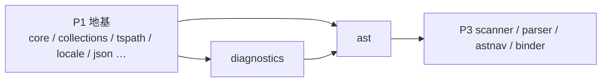

# Phase 2 — 诊断 + AST

> 方法论与共享契约见 **[../PORTING.md](../PORTING.md)（必读，尤其 §5 AST 所有权模型 + §8 测试对齐）**。
> 本 README 讲清 P2 的定位、两个包的边界与依赖、以及为什么 **AST 是整个移植的命门**。

## 一句话定位

**P2 在 Phase 1 地基之上，立起编译器的两块承重墙：诊断消息字典（`diagnostics`）与语法树（`ast`）。**
`ast` 是 arena + `NodeId` 所有权模型的**核心落地点**——能否用安全 Rust（零 `unsafe`）表达 Go 的"裸指针图 + 反向 `Parent` 指针 + 绑定期可变"，成败在此；后续 P3 parser/binder、P4 checker、P5 printer 全部建立在本包的节点表示之上。

## 依赖序（P2 在 DAG 第二层）

- `diagnostics` 依赖 P1 的 `core` / `locale` / `json`，**不依赖 ast**，是本 phase 的叶子，先做。
- `ast` 依赖 P1 的 `core` / `collections` / `tspath` **和** `diagnostics`（`Diagnostic` 引用 `Message`/`Category`/`Key`），后做。
- 二者都做完，P3 才能解析建树。

## 两个包的边界（每个含 impl.md + tests.md）

| 包 | crate | Go 源 | 职责 | 收口口径 |
|---|---|---|---|---|
| [`diagnostics/`](./diagnostics/) | `tsgo_diagnostics` | `internal/diagnostics/`（5 非测试 .go + `loc/` 14 个 `.json.gz` + 生成器 + 1 测试 / 2 func） | **可本地化诊断字典**：~2153 条 `Message{code,category,key,text}` 单例 + 14 语言译文（gzip+JSON 嵌入）+ locale 匹配 + `{0}/{1}` 占位符格式化 | `cargo test -p tsgo_diagnostics` 全绿（`TestLocalize` 13 + `TestLocalize_ByKey` 2，逐 case） |
| [`ast/`](./ast/) | `tsgo_ast` | `internal/ast/`（21 非测试 .go，含 `ast_generated.go`/`kind_generated.go` 两大生成文件；2 测试 / 6 func + 6 bench） | **地基 AST**：`Node`/~193 种 `NodeData`/~362 种 `Kind`/`NodeFactory`(arena)/遍历/深克隆/8 个标志族/`Symbol`/`Diagnostic`/`SourceFile`/`PositionMap`/`utilities`(417 函数) | `positionmap` 5 测试 P2 全绿；`deepclone` ~270 case 因依赖 parser **DEFER P3**，P2 用手工建树覆盖代表链路 |

## 为什么 AST 是命门（arena + NodeId 所有权模型）

Go 的 AST 是 **arena + 裸指针图**：单一 `ast.Node{ Kind, Flags, Loc, Parent *Node, data nodeData }`，`data` 是 ~193 个具体结构之一（≈判别联合），子节点/`Parent`/`NodeList` 全是裸 `*Node`，构成可有环（反向边）、绑定期可变的图。这在安全 Rust 里**不能**用 `&`/`Box` 直接表达。

P2 敲定的安全等价物（rust-analyzer / swc 主流做法，详见 [ast/impl.md](./ast/impl.md) 的"★ AST 所有权模型 ★"一节）：

| Go | Rust | 关键点 |
|---|---|---|
| `*Node`（子/父/列表元素） | `NodeId(u32)` / `Option<NodeId>` | 一切引用走 arena 索引，环与反向边变普通 `u32` → 零 unsafe |
| `Node{ Kind, …, data nodeData }` | `Node{ kind, flags, loc, parent, data: NodeData }` | **`Kind` 与 `NodeData` 双存**（Go 里 Kind 与 data 类型多对一，如 Token 服务 ~150 Kind） |
| `data nodeData`（接口/判别联合） | `enum NodeData { Identifier(..), CallExpression(..), … ~193 }` | enum + `match` 派发（PORTING §3：优先于 dyn） |
| `NodeList{ Nodes []*Node }` | `NodeList{ nodes: Vec<NodeId> }` | 或进 `node_lists` arena 用 `NodeListId` |
| 内嵌基类（`DeclarationBase` 等） | variant 字段 + `match` 访问器返回 `Option<&Base>` | 组合替代 Go 嵌入 |
| `NodeFactory` 各类型 `core.Arena[T]` | 单一 `NodeArena{ nodes: Vec<Node>, … }` | `new_xxx`→`push`+返回下标；`la-arena` 为可选替代（全仓二选一） |
| `node.Parent` | `parent(arena, id)` 访问器 | 语法偏离、结构 1:1（PORTING §5 授权） |
| `Symbol`/`Type` 图 | `SymbolId`/`TypeId` arena 同构 | 本包落 `Symbol`/`SymbolId`；`Type` 在 P4 |

8 个 `iota` 位标志族（`NodeFlags`/`SymbolFlags`/`ModifierFlags`/`TokenFlags`/`FunctionFlags`/`CheckFlags`/`FlowFlags`/`SubtreeFacts`）→ `bitflags!`（含全部组合常量，须逐值对齐 Go）。

## Go 测试规模速查（采自当前仓库）

| 包 | 实现文件 | 测试文件 | 测试函数 | 子用例 | 备注 |
|---|---|---|---|---|---|
| diagnostics | 5（含 2 大生成 + 生成器 + 14 `.json.gz`） | 1 | 2 | 15（`TestLocalize` 13 + `TestLocalize_ByKey` 2） | 译文 expected 含 CJK/西里尔，逐字节抄 |
| ast | 21（含 `ast_generated.go` 9560 行 / `kind_generated.go`） | 2 | 6（+6 bench） | ~270（deepclone）+ positionmap 内联断言 | deepclone 依赖 parser → DEFER P3 |

> diagnostics 的 ~2153 条消息与 14 语言译文由生成器（`generate.go` → 移植版 xtask）产出，**不手写**；ast 的 `ast_generated.rs`/`kind_generated.rs` 同理由移植版 `generate-go-ast` 产出。

## P2 的关键决策与红线

- **生成文件不手写**：`diagnostics_generated` / `loc_generated` / `ast_generated` / `kind_generated` 由移植版生成器产出。生成的 **`Key` 字符串、`text`、`Kind` 名、variant 字段名、区间常量**须与 Go 逐字节/逐一对齐（它们是跨包引用键 + 本地化查表键）；仅 Rust 内部变量名可按惯例改写（`SCREAMING_SNAKE_CASE` static / `CamelCase` 类型）。
- **零 unsafe**：AST 图一律 arena + `NodeId`，不用裸指针、不用 `Rc<RefCell>` 环。
- **`Kind` 不塌进 enum discriminant**：保留独立 `kind: Kind`，否则 Token 的 ~150 种 Kind 丢失，破坏 1:1。
- **locale 匹配 P2 用精简版**：Go 的 CLDR 语言距离（`x/text/language`）无直接 Rust 等价；P2 用"精确 + base 前缀 + 英语回落"覆盖单测全部 case，完整匹配 `// TODO(port)` 推迟（候选 `icu_locid`/`oxilangtag`）。
- **deepclone 测试 DEFER P3**：`deepclone_test.go` 用 `parsetestutil.ParseTypeScript` 建树，依赖 parser。P2 用手工建树（`NodeArena.new_*`）验证 `DeepCloneNode`/`VisitEachChild`/`for_each_child` 链路；全 ~270 case 在 P3 收口。

## 实施纪律（每个包收口前）

1. 读 `impl.md` + `tests.md` + **对应 Go 源 + `*_test.go`**（`ast_generated.go` 至少通读结构与 `Node`/`Kind` 生成模式）。
2. 先写 Rust 测试（red）→ 再写实现（green），逐文件、逐用例。先 `diagnostics`，后 `ast`。
3. `ast` 推进序：标志族 → `positionmap`（有单测，tracer bullet）→ `Kind`+最小 `NodeData`+`NodeArena` → `visitor`/`deepclone`（手工建树子集）→ 生成器接管全量 → `symbol`/`diagnostic`/`precedence`/`parseoptions`/`utilities`（随上层拉动）。
4. 验证：`cargo test -p tsgo_diagnostics` / `-p tsgo_ast` 全绿（deepclone 全量除外，标 DEFER）+ `cargo clippy` 干净 + rustdoc 规范自检（PORTING §7）。
5. tests.md 逐用例对齐审查（PORTING §8），impl.md 与 tests.md 互对齐；勾选文档，更新 [../README.md](../README.md) 进度。

## 进度

- [ ] **diagnostics** — `tsgo_diagnostics` 诊断字典 + 本地化（[impl.md](./diagnostics/impl.md) + [tests.md](./diagnostics/tests.md)）
- [ ] **ast** — `tsgo_ast` 地基 AST + arena/NodeId 所有权模型（[impl.md](./ast/impl.md) + [tests.md](./ast/tests.md)）

## 文档导航

| 想做什么 | 看哪里 |
|---|---|
| AST 所有权模型 / 类型映射 / 并发 / 注释 / 测试对齐 | [../PORTING.md](../PORTING.md) §5 / §3 / §7 / §8 |
| arena + NodeId + enum NodeData 详细设计 | [ast/impl.md](./ast/impl.md)（"★ AST 所有权模型 ★"节） |
| 诊断字典 / 本地化 / 生成器移植 | [diagnostics/impl.md](./diagnostics/impl.md) |
| deepclone ~270 case 分簇 + positionmap 1:1 | [ast/tests.md](./ast/tests.md) |
| 诊断 13+2 case 逐条（含各语言译文） | [diagnostics/tests.md](./diagnostics/tests.md) |
| Go 依赖 → Rust crate 映射 | [../references/crate-map.md](../references/crate-map.md) |
| Go 上游源码 | `internal/diagnostics/` · `internal/ast/`（ground truth；行号会漂移，用 `<file>:<func>` 锚） |
