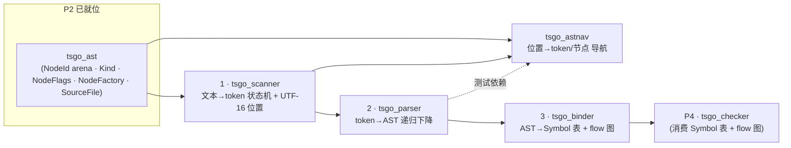

# Phase 3 — 词法 / 语法（scanner · parser · astnav · binder）

> 上承 **P2（diagnostics + ast）**，下启 **P4（checker）**。本 phase 把"源文本 → token → AST → 符号表 + 控制流图"这条编译前端主链路用 TDD 逐文件 1:1 移植到安全 Rust。
> 方法论 / 类型映射 / AST(arena+NodeId) / 注释 / 测试对齐规范见根 **[PORTING.md](../PORTING.md)（必读）**。

## 这个 phase 的主线：scanner → parser → binder（+ astnav）

P3 的四个包构成一条**严格的依赖链**，必须按序落地：

- **scanner**（词法）：把 UTF-8 源文本切成 `(Kind, value, flags, [pos,end))` token，并提供 byte↔UTF-16↔(line,character) 换算、trivia 跳过、注释/指令扫描、正则字面量校验。是 parser 的引擎。
- **parser**（语法）：持有一个 scanner + `NodeFactory`，递归下降把 token 流构造成 `SourceFile`（AST + 诊断 + JSDoc + pragma + 模块引用）。是整条链的产物中枢。
- **binder**（语义预处理）：遍历 AST，建 **Symbol 表**（locals/exports/members，含合并与冲突诊断）与**控制流图**（FlowNode/FlowLabel），把声明回挂到节点。**它的产物正是 P4 checker 的输入地基**。
- **astnav**（AST 导航）：位置→token/节点 的定位工具（语言服务底座）。依赖 ast+scanner，测试依赖 parser；与主链平行，随 parser 落地。

> **为什么顺序不可乱**：parser `next_token()` 直接驱动 scanner；binder `bind` 遍历的是 parser 产出的 AST；checker 需要 binder 建好的符号/流图。任一上游未编译通过 + 测试全绿，下游无法 TDD。

## 这个 phase 产出什么

每个包一个子目录，含 `impl.md`（移植步骤 + 文件清单 + 类型/所有权映射 + 可勾选 TODO）与 `tests.md`（逐 `func Test*` / 逐表驱动子用例对齐 Go 真实测试）：

| 子目录 | crate | Go 源（非测试） | 文档 |
|---|---|---|---|
| `scanner/` | `tsgo_scanner` | 4 文件（scanner/regexp/unicodeproperties/utilities） | [impl](./scanner/impl.md) · [tests](./scanner/tests.md) |
| `parser/` | `tsgo_parser` | 6 文件（parser/jsdoc/reparser/references/types/utilities） | [impl](./parser/impl.md) · [tests](./parser/tests.md) |
| `astnav/` | `tsgo_astnav` | 1 文件（tokens） | [impl](./astnav/impl.md) · [tests](./astnav/tests.md) |
| `binder/` | `tsgo_binder` | 3 文件（binder/nameresolver/referenceresolver） | [impl](./binder/impl.md) · [tests](./binder/tests.md) |

## 测试规模与"0 直接单测"现状（重要）

P3 的单测覆盖**非常稀疏**——这是真实情况，必须靠 P10 兜底，本轮按 PORTING §8.5 为每个稀疏包补**行为级 Rust 测试**：

| 包 | Go 测试文件 | `func Test*` 数 | 说明 |
|---|---|---|---|
| scanner | 0 | **0** | 无 `*_test.go`。行为由 **P10 parity 兜底** + 本轮补行为级（重点：UTF-16/行列换算、token 序列、rescan、标识符表）。 |
| parser | 1（`parser_test.go`） | **1**（`TestJSDocImportTypeParentChain`；另有 `BenchmarkParse`/`FuzzParser` 非单测） | 唯一单测=JSDoc import reparse 去重 + parent 链；其余 bench/fuzz → P10。 |
| astnav | 2（`tokens_test.go`+`testmain_test.go`） | **5 Test\* + 1 TestMain** | 多数是需 TS submodule + Node.js 的 **baseline 对拍**（→P10）；可移植的内联确定性用例 = `TestUnitFindPrecedingToken`(2 例) + `TestGetTokenAtPosition` 的 3 个内联子用例。 |
| binder | 1（`binder_test.go`） | **0**（仅 `BenchmarkBind`） | 无 `Test*`。行为由 **P10 parity 兜底** + 本轮补行为级（重点：建符号/合并/冲突诊断/最小流图）。 |

> 结论：P3 真正"可 1:1 复原的 Go 单测"只有 **parser 的 1 个 + astnav 的 5 个内联子用例**；scanner 与 binder 是 0 直接单测包。各 `tests.md` 已明确标注"行为由 P10 conformance/fourslash parity 兜底"，并给出行为级补充用例（expected 取自 spec / Go 实测，非 Rust 推断）。

## 本 phase 的命门（移植最易错处）

1. **UTF-16 位置语义（scanner）**：内部偏移全是 **UTF-8 字节**，仅对外换算 UTF-16 码元/(line,character)。`contains_non_ascii` 快路径、`utf16_len`、`ECMALineMap`、`compute_position_of_line_and_utf16_character` 必须逐函数对齐——星形面字符（emoji）= UTF-8 4 字节 / UTF-16 2 码元 是经典踩坑点。
2. **AST 所有权（parser）**：节点用 **arena + `NodeId`**（P2 落地），`finishNode` 设 `[pos,end)`、并 `contextFlags`、用 `NodeId` 回填子节点 `parent`（不用 Rust `&`）。投机解析（箭头 vs 括号）靠 `mark/rewind` + 诊断列表按长度截断。
3. **Symbol / Flow 双图（binder）**：Symbol 用 `SymbolId` arena、Flow 用 `FlowNodeId`/`FlowListId` arena，跨图引用一律索引——这是零 `unsafe` 表达 symbol-merge（绑定期可变）与 flow 图（环/共享前驱）的关键。顺序敏感的符号表用 `IndexMap`。
4. **token 缓存指针相等（astnav）**：`GetOrCreateToken` 须保证同位置合成 token 返回同一 `NodeId`（由 P2 SourceFile 缓存保证）。

## 实施纪律（每个包收口前）

1. 读该包 `impl.md` + `tests.md` + **对应 Go 源 + `*_test.go`**。
2. 先写 Rust 测试（red）→ 再写实现（green），逐文件、逐用例。0 直接单测包（scanner/binder）先写行为级测试再实现。
3. 验证：`cargo test -p tsgo_<pkg>` 全绿 + `cargo clippy -p tsgo_<pkg>` 干净 + rustdoc 规范自检（PORTING §7）。
4. tests.md 与 Go 测试逐用例对齐审查（PORTING §8），impl.md 与 tests.md 双向对齐。
5. 勾选文档，更新根 [README 进度](../README.md)。

## 与 Go 的已知偏离（本 phase 汇总）

- `node.Parent`/`symbol.Parent`/`flowNode.Antecedent` 等裸指针 → arena 索引（`NodeId`/`SymbolId`/`FlowNodeId`），**结构 1:1、语法偏离**（PORTING §5 允许且必要）。
- `ScannerState` 的 `Copy` 受 `String`/`Vec` 字段限制：`commentDirectives` 移出 state、用长度回滚（见 scanner/impl.md）。
- `missingListNodes` 的指针相等哨兵 → `NodeList` 加 `is_missing` 标志（parser）。
- **parser 无源码子包**：`internal/parser/` 下仅 `testdata/`（嵌套 fuzz 语料目录），无 `.go` 子包——用户清单所说"3 个子目录"实为 `testdata/`→`fuzz/`→`FuzzParser/` 三级语料目录，不产生子 crate/子 module。
- `sync.Pool`（parser/binder）→ 暂不池化或 `thread_local`（`// PERF(port)`）。
- `NameResolver`/`ReferenceResolver`/scanner `ErrorCallback` 的精确回调接口与 checker（P4）协同最终确定（本轮先用闭包字段/trait 表达）。
