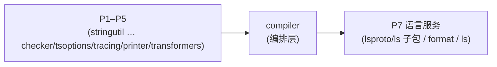

# Phase 6 · 编译管线（compiler）

把前面 5 个 phase（地基 / 诊断+AST / 词法语法 / 类型检查 / Emit）的零件**组装成一台编译器**。本 phase 是承上启下的"管线层"：上游是全部算法实现，下游是语言服务（P7）、LSP/工程/API（P8）、CLI（P9）。

> 方法论与共享契约见 **[../PORTING.md](../PORTING.md)（必读）**。本 README 只讲本 phase 的包、依赖序、并发要点与纪律。

> **⚠️ 依赖序修正（本轮）**：`tsoptions` 与 `tracing` 已**前移到 P4**（二者是 checker 的构建前置：checker→tsoptions/tracing，modulespecifiers/printer→tsoptions）。本 phase 现仅保留 **`compiler`**（编排层，依赖几乎整棵 crate 树，含 P4 的 tsoptions/tracing、P5 的 transformers）。`tsoptions`/`tracing` 的文档见 [phase-4-checker/](../phase-4-checker/)。

## 这个 phase 干什么（一句话）

- **`compiler`**：**编排层**——`NewProgram` 把 scanner/parser/binder/checker/transformers/printer/module/tsoptions/tracing 串成一个 `Program`，并行加载文件、构建包含图、按需检查、并行 emit。

## 依赖序（包内 DAG）

`compiler` 直接依赖 `tsoptions`（拿 `ParsedCommandLine`，现 P4）和 `tracing`（穿插事件，现 P4），且几乎依赖整棵 crate 树——这正是它作为编排层的标志。

## 子目录

| 包 | crate | 角色 | 文档 |
|---|---|---|---|
| `compiler` | `tsgo_compiler` | Program 构建、文件加载编排、emit | [compiler/impl.md](./compiler/impl.md) · [tests.md](./compiler/tests.md) |

> `tsoptions`（`tsgo_tsoptions`）/`tracing`（`tsgo_tracing`）已迁至 [phase-4-checker/](../phase-4-checker/)，本 phase 不再含其目录。

## compiler 是"编排层"——本 phase 的核心理解

`compiler` 本身**几乎不实现算法**。它的价值是把前面所有 phase 的产物**编织**成一个可用的 `Program`：

1. **串联**：`NewProgram(opts)` = `processAllProgramFiles`（并行加载全部文件，调 parser/module/tsoptions）→ `initCheckerPool`（建 checker 池，调 checker）→ `verifyCompilerOptions`（~400 行选项一致性诊断）。
2. **反向被调**：`Program` 实现了一堆上游 trait（`checker::Program` / `outputpaths` host / `ProgramLike`），checker/emit/LSP 反过来通过这些接口向 program 查"这个文件解析到哪 / 这个模块怎么解析 / 行列换算"。它是**双向枢纽**。
3. **数据归集**：所有"程序级"状态（`files`/`filesByPath`/`resolvedModules`/`sourceFileMetaDatas`/`includeReasons`/redirect 映射…）都汇聚在 `Program`（嵌入的 `processedFiles`）里，供全компилятор 共享。
4. **下游基座**：P7 的语言服务、P9 的 `tsc`/`tsc -b` 都拿 `*Program` 干活。把 P6 做对，P7–P9 才有地基。

所以读 compiler 的 impl.md 时，重点不是"它怎么算"，而是"**它在哪一步调谁、产出什么、并发如何保确定性**"。

## 并发要点（PORTING §6 在本 phase 的落地）

`compiler` 是全仓最集中的并发点。impl.md 专门标注了 **5 个并发站点**，统一遵循"**并行发现 / 处理，串行收集 + 稳定排序**"以保证输出与 Go 逐字节一致（确定性是 TDD 断言前提）：

| # | 站点（Go 文件） | 性质 | Rust 首选原语 | 确定性保证 |
|---|---|---|---|---|
| 1 | 文件加载（`filesparser.go`/`fileloader.go`） | 动态 worklist（任务生任务） | `rayon::scope` 递归 spawn + `DashMap` 去重 | `collectFiles` 串行深度优先 + `sortLibs` 稳定排序 |
| 2 | 项目引用（`projectreferenceparser.go`） | 动态 worklist | 同上 | `initMapper` 串行 + seen 去重（子覆盖父） |
| 3 | 绑定 / 诊断（`program.go`） | 固定 batch 数据并行 | `rayon::par_iter` → 预分配 `Vec` | `SortAndDeduplicateDiagnostics` 稳定序 |
| 4 | checker 池（`checkerpool.go`） | 按 checker 分组并行 | `rayon` over checkers + `Mutex<Checker>` | 文件 `i%K` 确定分配 + 收集后排序 |
| 5 | emit（`program.go`/`emitter.go`） | 数据并行 | `rayon::par_iter` + thread-local writer | 结果按输入顺序 `CombineEmitResults` |

**铁律**：任何并行收集后必须按稳定 key 排序或按输入顺序合并。`--singleThreaded` 走顺序版（`WorkGroup::Sequential`）便于调试。第一遍若某点难直译，先写顺序版 + `// PERF(port)`，绿后再并行化——但最终输出必须与并行版/Go 一致。

`tracing` 也有一个小并发点：多线程 `Push`/`end` 交错调用 + **线程 ID 稳定分配**（同组路径无论 begin 顺序得相同 TID），这是它两个单测的核心断言。

## 本 phase 测试规模速查

| 包 | 实现文件 | 测试文件 | 测试函数 | 测试性质 |
|---|---|---|---|---|
| tsoptions | 18 | 8 | 17(+TestMain) | 命令行/tsconfig 解析；多为 baseline，本 phase 用断言级覆盖关键字段，golden 归 P10 |
| tracing | 1 | 1 | 2 | 确定性并发（线程 ID 分配 + well-nested 事件） |
| compiler | 14 | 2 | 1 Test + 4 Bench | `TestProgram` 文件排序确定性；其余靠 P10 conformance/fourslash |

> 三个包都大量依赖后续/前序 phase 的真实实现（checker P4 / transformers·printer P5 / module·glob·vfsmatch / bundled libs）。impl.md 用 `// DEFER(phase-N)` 标注 blocked-by；端到端正确性统一归 **P10 parity**。各 tests.md 已把 Go 的每个 `func Test*` 与表驱动子用例 1:1 列出，并标明哪些走断言级（本 phase 可绿）、哪些走 golden/submodule（P10）。

## 实施纪律（每个包收口前）

1. 读 `impl.md` + `tests.md` + **对应 Go 源码 + `*_test.go`**。
2. 先写 Rust 测试（red）→ 再写实现（green），逐文件、逐用例。**compiler 务必先过 `TestProgram` 的顺序版，再并行化重过**。
3. 验证：`cargo test -p tsgo_<pkg>` 全绿 + `cargo clippy -p tsgo_<pkg>` 干净 + rustdoc 规范自检（PORTING §7）。
4. tests.md 与 Go 测试逐用例对齐审查（PORTING §8），impl.md 与 tests.md 互对齐。
5. 勾选文档，更新 `../README.md` 的 P6 进度。
