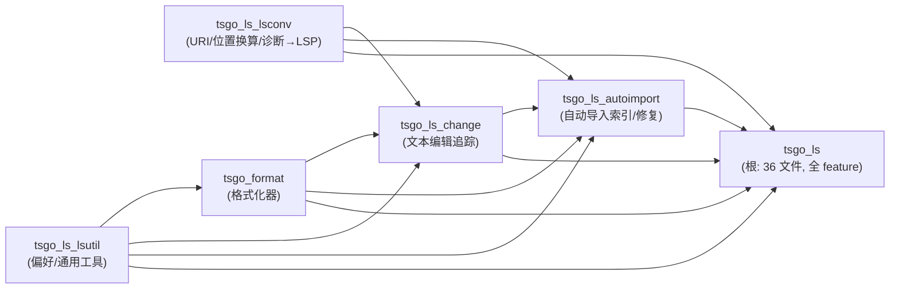

# Phase 7 · 语言服务（format / ls）

把 `internal/format` + `internal/ls`（含 4 个子包）逐文件 1:1 移植到 Rust。本 phase 是「编译器内核」与「LSP 服务器（P8）」之间的**语言服务层**：消费已 parse/checked 的程序，产出补全/悬停/跳转/引用/重命名/签名/语义高亮/code action/格式化等结果，并转成 LSP 协议类型。

> 方法论与共享契约见根 [PORTING.md](../PORTING.md)（必读）。各包细节见下表。

## 包清单（依赖序）与规模

| 包 | crate | 实现文件 | 测试文件 | 测试 func | impl/tests |
|---|---|---|---|---|---|
| format | `tsgo_format` | 10 | 5 | 6 Test + 1 Bench | [format/impl.md](./format/impl.md) · [format/tests.md](./format/tests.md) |
| ls | `tsgo_ls`（+4 子 crate） | 60（根 36 + lsconv 2 + lsutil 8 + change 3 + autoimport 11） | 8 | 21（含 TestMain） | [ls/impl.md](./ls/impl.md) · [ls/tests.md](./ls/tests.md) |

`format` 是叶子（依赖 P2/P3 的 ast/scanner/astnav + `ls/lsutil`）；`ls` 依赖 P1–P6 全部内核 + `format`。先 `format`、后 `ls`。

## crate 拆分与包关系（重要）

`internal/ls` 的 4 个子目录在 Rust 里**各拆一个 crate**（不作子 module），因为 `tsgo_format` 必须依赖 `lsutil`，若 `lsutil` 是 `tsgo_ls` 的子 module 会形成 `format→ls→format` 循环（Cargo 禁止）。统一拆 crate 也 1:1 映射 Go package。crate 依赖 DAG：

> 已核对无环：`lsutil/formatcodeoptions.go` 不 import `format`（仅 printer/lsproto/core），故 `format → lsutil` 单向。
>
> **本 phase 的 7 个 crate（均 P7，已记入根 README 映射与 [crate-map.md](../references/crate-map.md)）**：`tsgo_lsproto`（LSP 协议类型，前移自原 P8，被 lsconv/lsutil/change/autoimport/ls 依赖）→ `tsgo_ls_lsconv` / `tsgo_ls_lsutil` → `tsgo_format` / `tsgo_ls_change` → `tsgo_ls_autoimport` → `tsgo_ls`（根）。`ls/autoimport` 还依赖 `tsgo_project_dirty`/`tsgo_project_logging`（P1 叶子，从 `project` 拆出以破 `ls↔project` 环）。`project`/`api`/`lsp` 主体留在 P8。

## ls 与下游（P8 lsp/project）的关系

- **P8 `lsp`**：把 JSON-RPC 请求解码后调本层 `LanguageService.Provide<Feature>(ctx, params)`，再把 `lsproto.*Response` 编码回客户端。LSP **协议类型 `lsproto`**（`DocumentUri`/`Range`/各 `*Response` 联合/`ClientCapabilities`）已拆为独立 crate **`tsgo_lsproto` 并前移到本 phase（P7）**（早于 `ls`/`format`，因 `ls/lsconv`/`ls/lsutil` 等依赖它）——`tsgo_lsproto` 与本层同 phase，ls 的相关测试（如 `TestDocumentURIToFileName`，`DocumentUri.FileName()` 在 lsproto）不再 `// DEFER(phase-8)`，可在 P7 内收口。
- **P8 `project`**：实现本层的 `Host`（`ReadFile`/`Converters`/`AutoImportRegistry`/`GetPreferences`/`ReadDirectory`…）与 `CrossProjectOrchestrator`（跨工程并行编排 references/rename/implementations/callhierarchy），并维护 `autoimport.Registry` 的跨请求生命周期。
- **位置换算（`lsconv`）是地基**：LSP 用 0-based (line, **UTF-16** character)，内部用 UTF-8 字节偏移。`Converters.LineAndCharacterToPosition`/`PositionToLineAndCharacter` 在每个 `Provide*` 边界双向换算。Rust 侧需自实现镜像 `utf8.DecodeRuneInString`（含非法字节按 1 字节前进）+ `utf16.RuneLen`（BMP=1/补充平面=2）的逻辑——这是 PORTING crate-map.md「待定/UTF-16」的 P7 落点。

## 测试策略：单测稀疏，正确性靠 P10

`ls` 60 文件里**绝大多数特性没有 Go 单测**——补全/悬停/引用/重命名/签名/语义高亮/inlay/折叠/符号/code action/organize imports/诊断/定义/调用层级 等的**细粒度正确性由 P10 `fourslash`（4250 用例）+ `tests/baselines` 端到端 parity 兜底**。本 phase 的 8 个测试文件 21 个 func 只覆盖 4 个可纯函数化/集成化的点：

- `lsconv`：URI↔路径、UTF-16↔字节（含非法 UTF-8、与 Node TextDecoder 交叉验证）。
- `lsutil`：`UserPreferences` 序列化/解析/ATA、`ProbablyUsesSemicolons`。
- `autoimport`：泛型倒排 `Index`、camelCase 分词 `wordIndices`、符号链接 `getPackageRealpathFuncs`、`Registry` 增量生命周期（vfstest 集成）。
- `format.go`（ls 根）：onType/range 格式化**不 panic**（回归）。

`format` 包的单测（5 文件）也以「入口冒烟 + 不破坏注释 + 不 panic + 无行尾空白」为主；~250 条格式化规则的逐条效果同样推迟 P10（`tests/cases/fourslash/*format*`）。**fourslash 端到端测试整体在 P10**。

各包 tests.md 的「推迟到后续 phase 的测试」表逐条列出了归 P8/P10 的行为。

## 实施纪律（每包收口前）

1. 读 `impl.md` + `tests.md` + 对应 Go 源码 + `*_test.go`。
2. 先写 Rust 测试（red）→ 再写实现（green），逐文件、逐用例。
3. 验证：`cargo test -p <crate>` 全绿 + `cargo clippy -p <crate>` 干净 + rustdoc 规范自检（PORTING §7）。
4. tests.md 与 Go 测试逐用例对齐审查（PORTING §8），impl.md 与 tests.md 互对齐。
5. 勾选文档，更新根 README 进度（P7 行）。

## 存疑 / 偏离（汇总，详见各 impl.md）

1. **子包拆 crate**（非 PORTING §2 默认的「子 module」）：因 format↔lsutil 反向依赖会成环，4 子目录全部拆 `tsgo_ls_<name>` crate。
2. **`context.Context` → 显式参数**：format 的设置透传、ls 的 ClientCapabilities/locale/UserPreferences/取消标志，改显式传参 + `&Cancel`。
3. **`userpreferences.go` 的 `reflect`**：Rust 无运行时反射 → 改手写字段表 / serde 自定义（待定是否引 proc-macro）。
4. **UTF-16 换算**：自实现 `decode_utf8_rune`（镜像 Go RuneError 语义）+ utf16 长度；建议在 crate-map.md「待定/UTF-16」转正。
5. **并行**：crossproject/registry/多文件搜索从 goroutine+SyncMap → rayon/scoped+dashmap，结果**保序**以保证 `combine*` 输出与断言确定。
