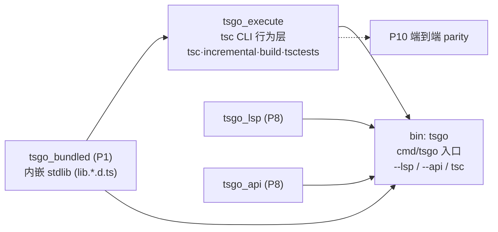

# Phase 9：执行 / CLI 入口（execute · cmd/tsgo）

本 phase 把 typescript-go 的**命令行可执行产物**那一层移植到 Rust：tsc 的全部命令行行为（单次/增量/watch/项目引用构建/init/showConfig/help），再到真正的二进制入口。它是整条编译管线（P1–P8）之上、面向用户的最后一层胶水；下游只剩 P10 的端到端一致性对拍。

> 方法论与共享契约见根目录 [PORTING.md](../PORTING.md)（必读）。本文件只讲本 phase 的包、依赖序、测试策略与纪律。

> **⚠️ 依赖序修正（本轮）**：`bundled`（`tsgo_bundled`，内嵌 stdlib，近叶子，仅依赖 `repo`/`tspath`/`vfs`）已**前移到 P1**——它被 `ls/lsconv`(P7)/`lsp`/`api`(P8)/`cmd/tsgo` 共同依赖，留 P9 会倒置。本 phase 现含 **`execute` 与 `cmd/tsgo`** 两个包；`bundled` 的实现文档见 [phase-1-foundation/bundled/](../phase-1-foundation/bundled/)。

## 包（按依赖序，叶子在前）



### 1. `bundled`（`tsgo_bundled`，**现位 P1**）——内嵌的 stdlib
把 TypeScript 自带的 110 个 `lib.*.d.ts`（最大 `lib.dom.d.ts` ≈2.3MB）**编译进二进制**，通过 `bundled:///libs/` 伪文件系统暴露给编译器，做到"零外部依赖的单文件 tsc"。提供 `WrapFS(fs)`（内嵌路径重定向）、`LibPath()`、构建期开关（embed/noembed）与再生成器。

**内嵌方案（Rust）**：
- **数据内嵌** = `include_str!`（等价 Go `//go:embed string`）：生成并提交 `embed_generated.rs`，每个 lib 一条 `include_str!("libs/lib.X.d.ts")`，汇成 `phf::Map`（或 `LazyLock<FxHashMap>`）`EMBEDDED_CONTENTS`。`rustc` 链接期并入 `.rodata`，运行时零 I/O、`&'static str` 借用。
- **构建期开关** = Cargo feature `embed`（默认开）：`#[cfg(feature="embed")]` 走内嵌、`#[cfg(not)]` 走磁盘回退（对应 Go `//go:build noembed`）。
- **再生成** = xtask 二进制 `generate-libs`（对应 `generate.go` + `go generate`）：读 TS 子模块 `src/lib/libs.json`（strip JSONC）+ 版权头 → 写 `libs/*.d.ts` + 生成 `libs_generated.rs`(`LIB_NAMES`) / `embed_generated.rs`。产物入库、手动运行（不用 build.rs，与 go:generate 一致）。
- 备选：`include_bytes!`（省 UTF-8 校验，需手动 from_utf8）；不采用 `rust-embed`（其运行时建索引 + debug 回退磁盘，与"直接实现 vfs::FS、避免拷贝"诉求冲突）。

### 2. `execute`（`tsgo_execute`）——tsc 命令行行为层
这是 phase 的主体：把"已解析命令行 + program + emit"粘合成 `tsc` 体验。一个 crate，四个子模块（内部依赖序 `tsc → incremental → build → 根`，外加测试基座 `tsctests`）：

- **`tsc/`**：`System` 接口、`ExitStatus`、`EmitFilesAndReportErrors`（bind→check→emit→报告核心循环）、诊断报告器（pretty/color/watch 状态）、`--help` 排版、`--init` 生成 tsconfig、`Statistics`、并发安全的 `ExtendedConfigCache`。
- **`incremental/`**：`--incremental` 引擎——快照（fileInfos/版本/签名/引用图/每文件诊断缓存/待 emit 集）、`.tsbuildinfo` 双向序列化（紧凑变体编码 + xxh3 签名）、受影响文件传播、增量 emit。**含并发**（受影响文件/emit 用 WorkGroup 并行，按源序确定性收集）。
- **`build/`**：`-b/--build` 项目引用编排——引用图拓扑排序 + 环检测、并行任务调度（worker 池 + 任务间 `done`/`reportDone` channel + 串行 flush 保确定性）、18 种 up-to-date 判定、伪构建（仅更新时间戳）、`--clean`/`--dry`/`--verbose`、`-b --watch`。
- **根（`tsc.go`/`watcher.go`）**：`CommandLine` 总分发；watch 模式（轮询文件 → 增量重建，单 `Mutex` 串行 `DoCycle`）。
- **`tsctests/`**：baseline 对拍基座（`TestSys`/`NewTscSystem`/可读 buildInfo）——**主要服务 P10**，但 `NewTscSystem`/`TestSys` 也支撑本 phase 的 build 图测试与 watcher race 测试。

### 3. `cmd/tsgo`（bin crate `tsgo`）——真正的入口
极薄的二进制：`os.Args` 第一参 `--lsp`→LSP server、`--api`→API server、其余→`execute.CommandLine`，退出码 = `ExitStatus`。装配真实环境（`bundled::wrap_fs(osvfs)` + `bundled::lib_path()` + 终端能力 + 父进程看护狗 + 信号）。**平台条件编译**是重点：

- `.rs` 与 `.go` 同目录同名（`cmd/tsgo/main.rs` 等），crate 名 `tsgo`，`[[bin]] path="cmd/tsgo/main.rs"`。
- Go build tag → Rust `#[cfg]`：`isprocessalive_{unix,windows,other}.rs`（`#[cfg(unix)]`/`#[cfg(windows)]`/`#[cfg(not(any(unix,windows)))]`）、`enablevtprocessing_windows.rs`（`#[cfg(windows)]`）。
- Go 包级 `init()`（Windows 开 VT）无 Rust 等价 → 改 `main` 开头显式调 `enable_vt_processing()`（非 Windows 同名空函数）。
- `context.Context` + `signal.NotifyContext` → `Arc<AtomicBool>` 取消标志 + `ctrlc`（不引 async）；看护狗 = `std::thread` 每 5s 探活父进程，死则置标志。

## crate / 命名约定

| 包 | crate | 类型 | 入口 |
|---|---|---|---|
| `internal/bundled` | `tsgo_bundled` | lib | `internal/bundled/lib.rs` |
| `internal/execute` | `tsgo_execute`（子模块 `tsc`/`incremental`/`build`/`tsctests`） | lib | `internal/execute/lib.rs` |
| `cmd/tsgo` | `tsgo` | **bin** | `cmd/tsgo/main.rs` |

> execute 的 4 个子目录按用户约定作**单一 `tsgo_execute` crate 的子模块**（非独立 crate），内部依赖序靠 `mod` 顺序/可见性维持；若执行期发现需独立外部依赖再拆 crate。

## 测试规模与策略（关键：baseline 与 P10 的关系）

| 包 | 测试文件 | `func Test*` | 子用例（约） | 本 phase 处理 |
|---|---|---|---|---|
| bundled | 1 | 2 | 2 + 10 补充 | 全部本 phase（`TestTestingLibPath`/`TestEmbeddedLibs` + 内嵌 FS 行为补测） |
| execute | 8 | **50** | ~740 | 见下分类 |
| cmd/tsgo | 0 | 0 | 0 + 13 补充 | 0 直接单测 → 补行为级测试 + P8/P10 兜底 |

**execute 的 50 个 func 分三类**（这是本 phase 的核心纪律）：

- **A. 真单测（纯逻辑/图算法，本 phase 必过，12 子用例）**
  - `build/graph_test.go::TestBuildOrderGenerator`（9 子用例）——项目引用图拓扑序 + 环检测，expected 是确定的构建序数组（如 `["A","H"]→["D","E","C","B","A","J","I","H"]`）。**不依赖 emit/testdata**，是 build 最早可验证的真单测。
  - `tsc/extendedconfigcache_test.go::TestExtendedConfigCacheExtendsCircularity`（3 子用例）——extends 成环应报循环诊断（code 18000）而非死锁。
- **B. 并发 race 测试（本 phase 移植，6 func）**——`watcher_race_test.go` 从多线程并发调 `DoCycle` + 改文件，Go 用 `-race` 检测；Rust 用线程压测 + ThreadSanitizer/loom，断言无死锁/panic。
- **C. baseline 对拍（`—` DEFER → P10，41 func / ~338 子场景 + ~249 edit）**——`tsc_test.go`(16)/`tscbuild_test.go`(22)/`tscwatch_test.go`(2)/`showconfig_test.go`(1)。这些跑 `execute.CommandLine` 后把 FS/命令/退出码/输出/emit/program/`.tsbuildinfo`(+`.readable.baseline.txt`) 序列化进 `baselines/reference/*.js` 对拍，并把增量构建与全量重建互拍（`getDiffForIncremental`）。**ground truth 是 testdata 基线文件**，需 `testutil/{baseline,harnessutil,fsbaselineutil,stringtestutil}` 框架 + 与 Strada 逐字符对齐——属 **P10 端到端 parity**。本 phase 只保证这些场景背后的实现逻辑（CLI 分发/增量/build/watch）跑通。
- **D. 测试主入口**——`testmain_test.go::TestMain`（baseline.Track 初始化），非行为测试。

> 即：本 phase 的测试 gate = **bundled 全部 + execute 的 A/B 类（18 func/53 子用例）+ cmd/tsgo 补充行为测试**；execute 的 C 类（41 func）与 baseline 框架本体在 **P10** 收口。这与 PORTING.md §6"fourslash/testdata 推迟到 P10"一致——execute 的 baseline 对拍正是 testdata 依赖的端到端 parity。

## 本 phase 依赖的上游（DEFER 锚点）

execute/cmd-tsgo 的函数体实现依赖大量上游 crate，实现时用 `// DEFER(phase-N) blocked-by:` 标注：

- **P1**：`core`（WorkGroup/Tristate/Version/Must）、`collections`（SyncMap/Set）、`tspath`、`vfs`(+`osvfs`/`cachedvfs`/`trackingvfs`/`vfswatch`)、`json`、`locale`、`pprof`、`repo`、`diagnostics`、`diagnosticwriter`。
- **P2–P5**：`ast`、`parser`、`binder`、`checker`、`printer`、`outputpaths`。
- **P6**：`tsoptions`（命令行/配置解析、ParsedCommandLine/ParsedBuildCommandLine、ExtendedConfigCache 接口）、`tracing`、`compiler`（Program/ProgramLike/Emit/CompilerHost）。
- **P7**：`format`、`ls`（`fmtMain`）。
- **P8**：`lsp`（Server）、`api`（StdioServer）—— cmd/tsgo 的 `--lsp`/`--api`。

## 新增依赖（→ references/crate-map.md）

| 用途 | crate | 用在 |
|---|---|---|
| 内嵌完美哈希 | `phf`(+`phf_macros`) | bundled |
| xxh3-128 哈希（buildInfo 签名，须与 `zeebo/xxh3` 字节对齐） | `xxhash-rust`(`xxh3`) 或 `twox-hash` | execute/incremental |
| channel（任务依赖/worker 池） | `crossbeam-channel` | execute/build |
| 并发 map/set | `dashmap` | execute |
| bitflags | `bitflags` | execute (`FileEmitKind`) |
| 有序 map | `indexmap` | execute (buildInfo Options) |
| 终端宽度 | `terminal_size` | cmd/tsgo |
| 信号 | `ctrlc`(或 `signal_hook`) | cmd/tsgo |
| Windows syscalls | `windows-sys` | cmd/tsgo（cfg windows） |
| unix syscalls | `libc`(或 `nix`) | cmd/tsgo（cfg unix） |

> `xxh3` 必须执行期写 golden 对照确认与 Go 输出逐字节一致（影响 `.tsbuildinfo` 内容与 P10 对拍）。

## 实施纪律（每个包收口前）

1. 读本目录 `<包>/impl.md` + `tests.md` + 对应 Go 源 + `*_test.go`。
2. 先写 Rust 测试（red）→ 再写实现（green），逐文件、逐用例。先攻 A/B 类真单测（不依赖 testdata），baseline（C 类）留 P10。
3. 验证：`cargo test -p tsgo_<pkg>` 全绿（A/B 类）+ `cargo clippy` 干净 + rustdoc 规范（PORTING §7）。incremental 加 `snapshot↔buildInfo` round-trip 自测。
4. 并发点确认**输出确定性**（受影响文件/emit/任务报告按稳定 key 排序）——这是 P10 baseline 可复现的前提。
5. 勾选文档，更新根 README 进度（P9）。

## 目录

```
phase-9-execute-cli/
├── README.md            # 本文件
├── execute/             # tsgo_execute：tsc CLI 行为层（tsc/incremental/build/tsctests）
│   ├── impl.md
│   └── tests.md
└── cmd-tsgo/            # bin crate tsgo：入口（.rs 落在 cmd/tsgo/ 同目录同名）
    ├── impl.md
    └── tests.md

# bundled/ 已前移到 phase-1-foundation/bundled/（tsgo_bundled）
```
